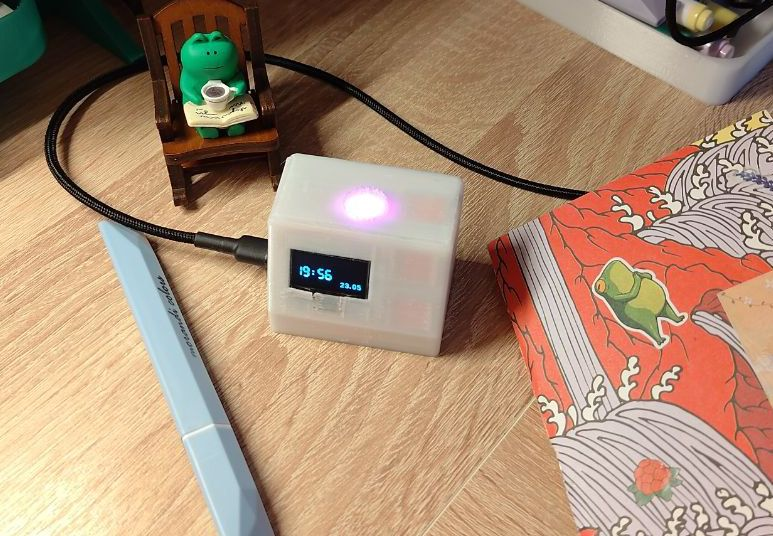
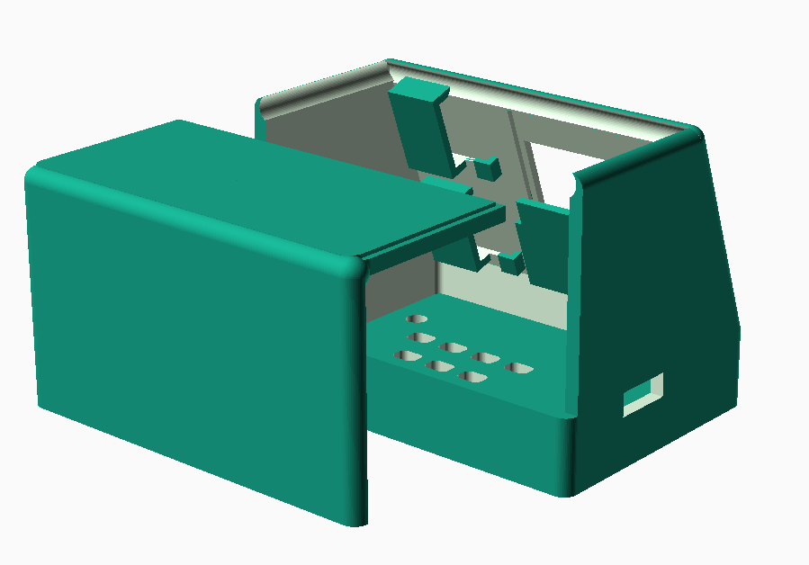
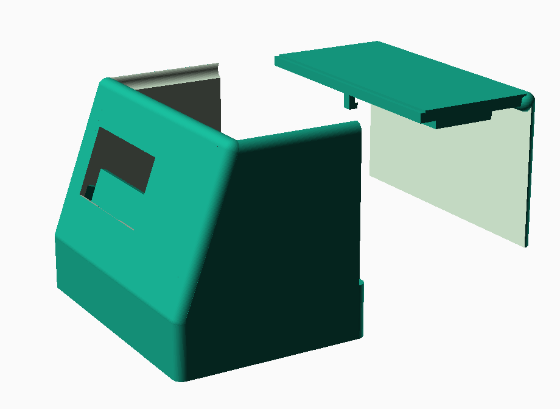
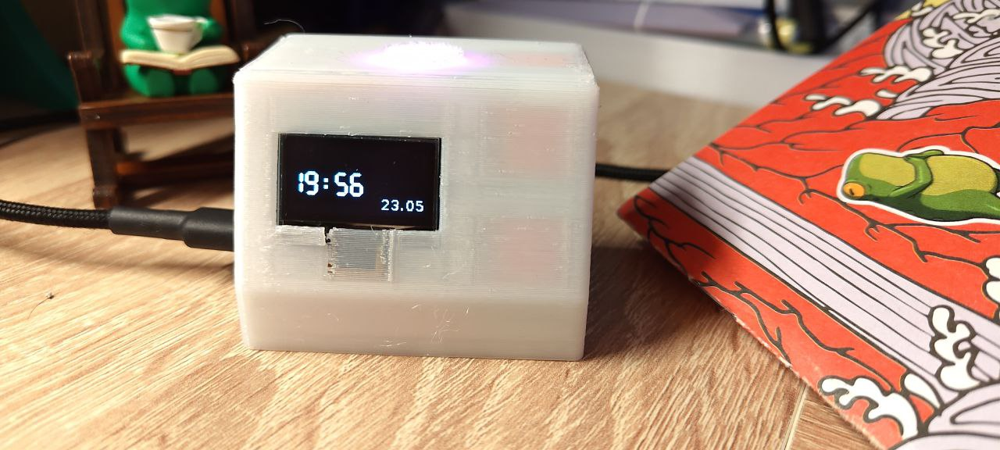
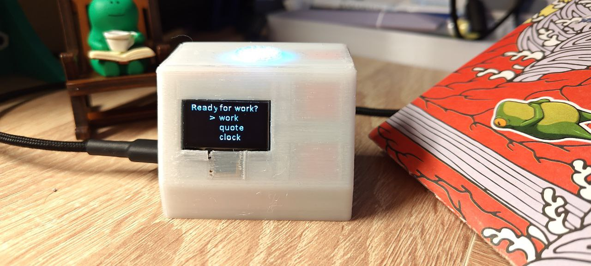
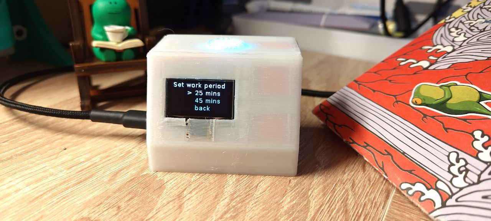
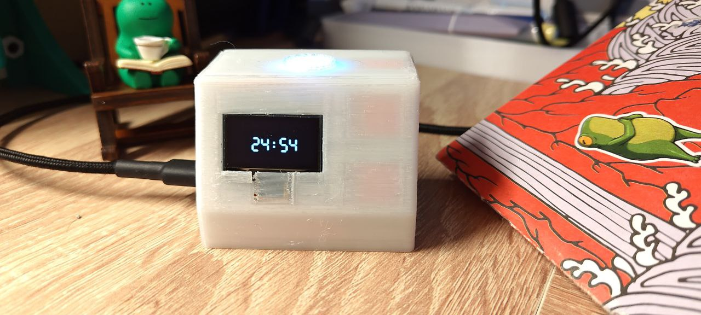
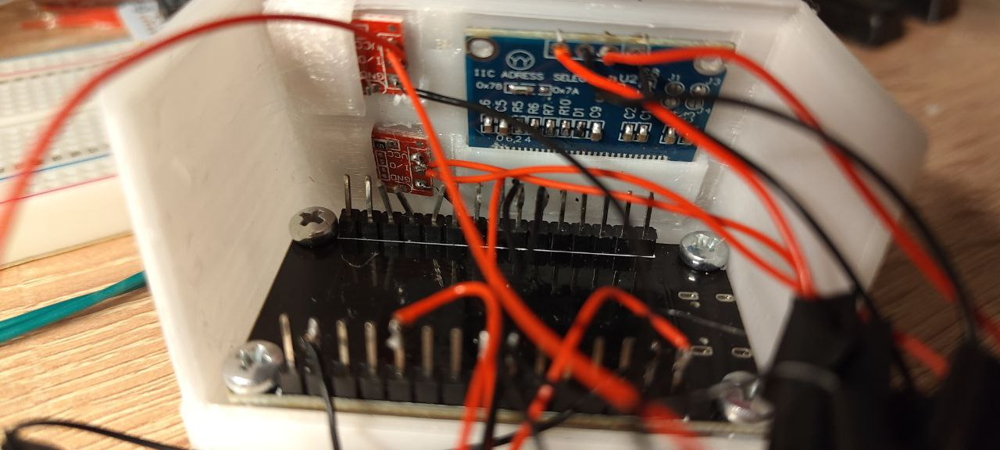
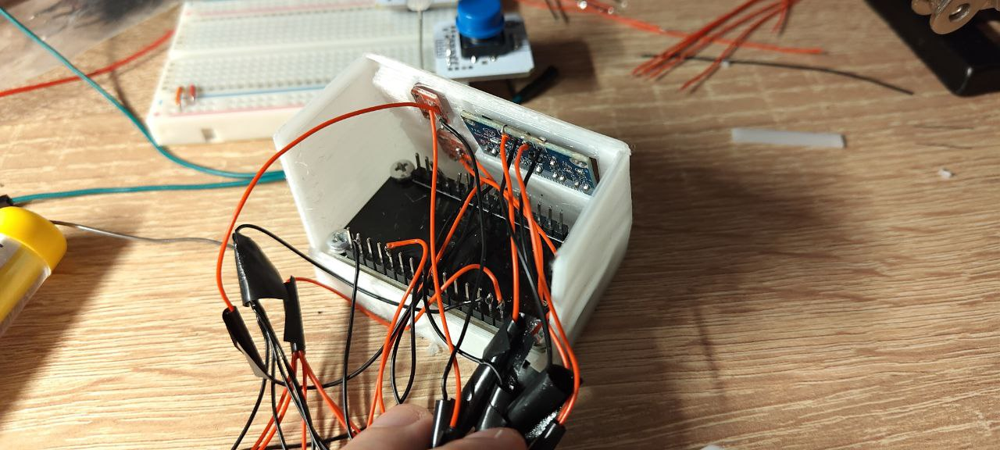

# pomodoro-with-extra-features

This is code for running pomodoro with clock and some extra features on ESP-32.

# Hardware

* ESP-32
* TTP223 sensor buttons x3
* SSD1306 based oled screen, 128x64
* WS2812B single led
* 2.4k Ohm resistor x2 for I2C

# How to run

If you want to run this, you will need this firmware [Lua-RTOS-ESP32](https://github.com/whitecatboard/Lua-RTOS-ESP32).

Also, rename `config.lua.default` to `config.lua` and specify your connection settings. This will allow getting correct time from NTP servers.

You can upload files to esp using [wcc](https://github.com/whitecatboard/Lua-RTOS-ESP32/wiki/How-to-transfer-files), or by using script [upload.ps1](upload.ps1). Sorry, no version for Linux yet.

# Case

[Printables link](https://www.printables.com/model/1305543-pomodoro-with-extra-features)

Case is very WIP, you will need to break some things after 3d printing. Also, it is not very optimized for printing now, you will need supports inside the case(supports touching only buildplate wont do). If you wish to make it better - make bigger pockets for components, and don't forget screws holders on back wall (as i did and then i just glued two parts).

Components holding in place by small tpu pads. Or you can use some rubber pads, they will work the same. Also, I put small white tpu circle on top of led as improvised light diffusor.

# Extra images

